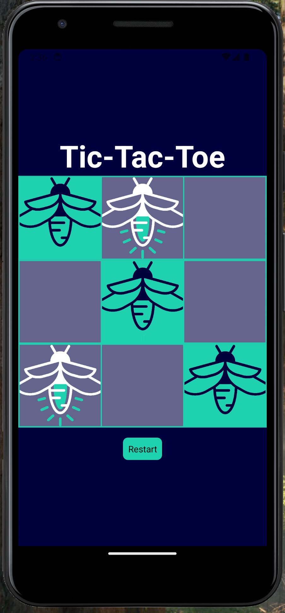

# Atlas Tic-Tac-Toe

This template provides a minimal setup to get React native working with Expo.



## Project Requirements

- Create a two player tic-tac-toe game
- Players take turns placing tokens on the board
- Game end when a player has three in a row or all cells are filled

### Local Development

```bash
npm install
npm start
```
